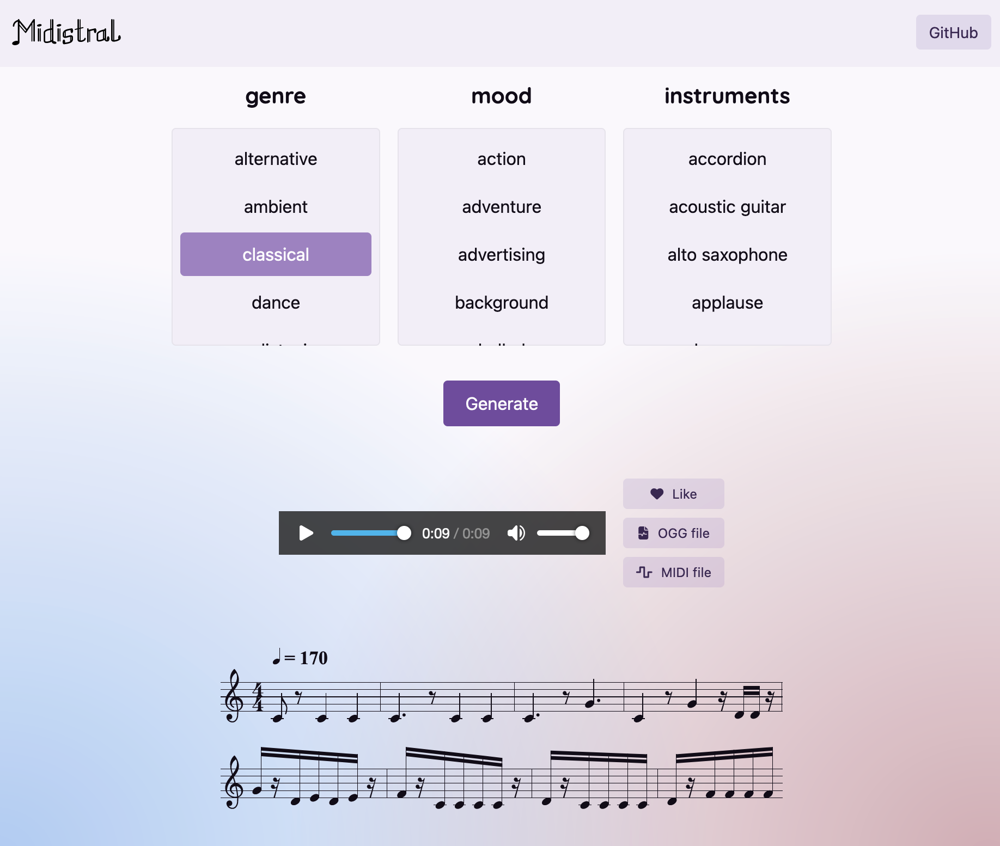

# Midistral

This repository contains code :
- [to finetune and serve a finetuned Mistral model](./backend/README.md) to generate [ABC notation](https://abcnotation.com/) (and [MIDI file](https://en.wikipedia.org/wiki/MIDI)). The finetuned model is named Midistral.
- [to interact through a web UI](./frontend/README.md) with the Midistral model 

## Future developments

- Improve model
  - Use more MIDI datasets (e.g. projectlosangeles/Los-Angeles-MIDI-Dataset, VGMusic, ...)
  - Test RAG approach
  - Adapt finetuning to follow more "instruments" constraints
  - Support more voices/tracks
  - Support more Natural Language text input
  
- Improve front-end
  - Allow user generations sharing
